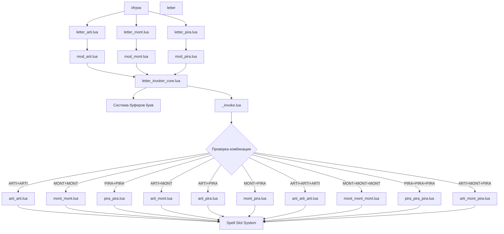

# Letter Invoker - Архитектура системы

## Обзор системы

Letter Invoker - это сложная система способностей, основанная на механике комбинирования трёх букв (ARTI, MONT, PIRA) для создания уникальных заклинаний. Система полностью совместима с Dota 2 Workshop Tools и использует Lua для всей логики.

## Структура файлов

```
scripts/vscripts/abilities/
├── letter_invoker_core.lua      # Центральный контроллер системы
├── letter_arti.lua              # Способность: добавляет букву ARTI
├── letter_mont.lua              # Способность: добавляет букву MONT
├── letter_pira.lua              # Способность: добавляет букву PIRA
├── letter_invoke.lua            # Способность: комбинирует буквы в заклинание
├── modifiers/
│   ├── mod_arti.lua             # Модификатор буквы ARTI (20s duration)
│   ├── mod_mont.lua             # Модификатор буквы MONT (20s duration)
│   └── mod_pira.lua             # Модификатор буквы PIRA (20s duration)
└── invoked/
    ├── arti_arti.lua            # ARTI + ARTI: Defensive Construct (щит)
    ├── mont_mont.lua            # MONT + MONT: Movement Speed (ускорение)
    ├── pira_pira.lua            # PIRA + PIRA: Pure Damage (урон)
    ├── arti_mont.lua            # ARTI + MONT: Control AoE (контроль)
    ├── arti_pira.lua            # ARTI + PIRA: Heal (лечение)
    ├── mont_pira.lua            # MONT + PIRA: Stun (оглушение)
    ├── arti_arti_arti.lua       # ARTI + ARTI + ARTI: Area Control Ultimate
    ├── mont_mont_mont.lua       # MONT + MONT + MONT: Global Mobility
    ├── pira_pira_pira.lua       # PIRA + PIRA + PIRA: High Damage Nuke
    └── arti_mont_pira.lua       # ARTI + MONT + PIRA: Hybrid Ultimate
```

## Архитектурная диаграмма системы



## Центральный контроллер (letter_invoker_core.lua)

Этот модуль управляет всей логикой Letter Invoker:

```lua
-- Центральный класс LetterInvokerCore
LetterInvokerCore = class({})

function LetterInvokerCore:Init()
    -- Инициализация буферов букв
    self.letterBuffer = {
        arti = 0,
        mont = 0, 
        pira = 0
    }
    
    -- Максимальное количество букв одного типа
    self.maxLettersPerType = 2
    
    -- Длительность букв (секунды)
    self.letterDuration = 20.0
    
    -- Система слотов заклинаний (как у Invoker)
    self.spellSlots = {
        primary = nil,  # Основной слот
        secondary = nil # Вторичный слот
    }
    
    -- Таблица комбинаций
    self.combinations = {
        -- Двубуквенные комбинации
        ["arti_arti"] = "invoked_arti_arti",
        ["mont_mont"] = "invoked_mont_mont",
        ["pira_pira"] = "invoked_pira_pira",
        ["arti_mont"] = "invoked_arti_mont",
        ["arti_pira"] = "invoked_arti_pira",
        ["mont_pira"] = "invoked_mont_pira",
        -- Трёхбуквенные комбинации
        ["arti_arti_arti"] = "invoked_arti_arti_arti",
        ["mont_mont_mont"] = "invoked_mont_mont_mont",
        ["pira_pira_pira"] = "invoked_pira_pira_pira",
        ["arti_mont_pira"] = "invoked_arti_mont_pira"
    }
end
```

## Система букв

### Добавление буквы

Когда игрок использует способность буквы (например, `letter_arti`), происходит следующее:

1. Проверка: есть ли место в буфере для этой буквы
2. Если да - добавляем модификатор `mod_arti` к герою
3. Модификатор автоматически обновляет таймер (20 секунд)
4. Если буква уже есть - обновляем длительность

### Модификаторы букв

Каждый модификатор буквы хранит:
- ID буквы (arti/mont/pira)
- Время создания
- Длительность (20 секунд)

```lua
-- mod_arti.lua
LinkLuaModifier("mod_arti", "abilities/modifiers/mod_arti", LuaModifierType.MULTIPLE)

mod_arti = class({
    IsHidden = function(self) return false end,
    IsDebuff = function(self) return false end,
    IsPurgable = function(self) return false end,
    
    GetTexture = function(self) return "artillery" end,
    
    OnCreated = function(self)
        self.artiCount = 1
        -- Обновляем счётчик в core
        LetterInvokerCore:AddLetter("arti")
    end,
    
    OnDestroy = function(self)
        -- Уменьшаем счётчик в core
        LetterInvokerCore:RemoveLetter("arti")
    end
})
```

## Система Invoke

Invoke работает следующим образом:

1. Проверяет текущие активные буквы (через core)
2. Сортирует буквы для определения комбинации
3. Ищет соответствующее заклинание в таблице комбинаций
4. Если найдено - добавляет заклинание в слот
5. Очищает использованные буквы

```lua
-- letter_invoke.lua
function letter_invoke:OnSpellStart()
    local caster = self:GetCaster()
    local core = LetterInvokerCore:GetInstance()
    
    -- Получаем текущие буквы
    local currentLetters = core:GetCurrentLetters()
    
    if #currentLetters < 2 then
        -- Недостаточно букв для комбинации
        self:EndCooldown()
        return
    end
    
    -- Сортируем буквы для определения комбинации
    table.sort(currentLetters)
    local combinationKey = table.concat(currentLetters, "_")
    
    -- Ищем заклинание
    local spellName = core:GetSpellForCombination(combinationKey)
    
    if spellName then
        -- Добавляем заклинание в слот
        core:AddSpellToSlot(spellName)
        
        -- Очищаем использованные буквы
        core:ClearLetters()
    end
end
```

## Система слотов заклинаний

Система слотов позволяет хранить и использовать вызванные заклинания:

- **Primary Slot** - основной слот для заклинаний
- **Secondary Slot** - дополнительный слот (опционально)
- Каждое заклинание имеет свой cooldown
- При вызове нового заклинания старое заменяется

```lua
function LetterInvokerCore:AddSpellToSlot(spellName)
    local caster = self:GetCaster()
    
    -- Удаляем предыдущее заклинание из слотов
    if self.spellSlots.primary then
        caster:RemoveAbility(self.spellSlots.primary)
    end
    
    -- Добавляем новое заклинание
    self.spellSlots.primary = spellName
    caster:AddAbility(spellName)
    
    -- Обновляем UI (если нужно)
    self:UpdateSpellUI()
end
```

## Описание заклинаний

### Двубуквенные комбинации

#### ARTI + ARTI: Defensive Construct (Щит)
- Создаёт защитную конструкцию вокруг героя
- Даёт shield на X HP на Y секунд
- Можно использовать на союзников

#### MONT + MONT: Movement Speed (Ускорение)
- Даёт значительное увеличение скорости передвижения
- Бонус: +X% speed на Y секунд
- Можно использовать на союзников

#### PIRA + PIRA: Pure Damage (Урон)
- Наносит чистый урон цели
- Урон: X + Y% от силы героя
- Промах невозможен

#### ARTI + MONT: Control AoE (Контроль)
- Созёт область замедления
- Замедление: X% на Y секунд
- Радиус: Z

#### ARTI + PIRA: Heal (Лечение)
- Восстанавливает HP союзнику
- Лечение: X + Y% от интеллекта героя
- Можно использовать на себя

#### MONT + PIRA: Stun (Оглушение)
- Оглушает цель на X секунд
- Урон: Y
- Дальность: Z

### Трёхбуквенные комбинации

#### ARTI + ARTI + ARTI: Area Control Ultimate
- Создаёт большую контролируемую зону
- Враги внутри получают замедление и урон
- Длительность: X секунд
- Радиус: Y

#### MONT + MONT + MONT: Global Mobility
- Телепортирует героя в любую точку карты
- Даёт speed boost после телепорта
- Можно использовать на союзников (с дальностью)

#### PIRA + PIRA + PIRA: High Damage Nuke
- Наносит огромный чистый урон по области
- Урон: X + Y% от силы героя
- Радиус: Z

#### ARTI + MONT + PIRA: Hybrid Ultimate
- Комбинация всех трёх тем
- Наносит урон + замедляет + даёт щит союзникам
- Максимальная универсальность

## Баланс и игровые механики

### Общие принципы баланса

1. **Mana Cost** - каждая буква тратит маны (15-25)
2. **Cooldown** - Invoke имеет небольшой cooldown (6 секунд)
3. **Время жизни букв** - 20 секунд создаёт urgency
4. **Гибкость** - возможность комбинировать даёт вариативность

### Примерные значения баланса

| Комбинация | Mana Cost | Cooldown | Effect Value |
|------------|-----------|----------|--------------|
| letter_arti | 20 | 2s | +1 ARTI stack |
| letter_mont | 20 | 2s | +1 MONT stack |
| letter_pira | 25 | 2s | +1 PIRA stack |
| letter_invoke | 0 | 6s | Invoke combo |
| arti_arti | 100 | 12s | 200 shield |
| mont_mont | 80 | 8s | +50% speed |
| pira_pira | 120 | 10s | 300 pure damage |
| arti_mont | 90 | 14s | 40% slow, 3s |
| arti_pira | 110 | 10s | 250 heal |
| mont_pira | 100 | 12s | 2s stun, 150 dmg |

## Визуальные эффекты

Для каждой буквы и заклинания нужны:

1. **Частицы (particles)**
   - ARTI: синие/структурные частицы
   - MONT: зелёные/скоростные частицы  
   - PIRA: красные/огненные частицы

2. **Иконки способностей**
   - Отдельные иконки для каждой буквы
   - Иконки для каждого вызванного заклинания

3. **Звуки (sounds)**
   - Звук добавления буквы
   - Звук invoke
   - Уникальные звуки для ультов

## Локализация

Все названия и описания должны быть в `resource/addon_english.txt`:

```
"DOTA_Tooltip_modifier_arti" "ARTI"
"DOTA_Tooltip_modifier_arti_Description" "Структурная энергия ARTI"
"DOTA_Tooltip_letter_arti" "ARTI"
"DOTA_Tooltip_letter_arti_Description" "Добавляет букву ARTI"
"DOTA_Tooltip_invoked_arti_arti" "Defensive Construct"
"DOTA_Tooltip_invoked_arti_arti_Description" "Создаёт защитную конструкцию"
```

## Тестирование

План тестирования:

1. **Unit Tests** - тесты логики комбинаций
2. **Integration Tests** - тесты взаимодействия модулей
3. **Manual Testing** - тесты в редакторе
   - Проверка всех комбинаций
   - Проверка таймеров букв
   - Проверка слотов заклинаний
   - Проверка баланса

## Расширяемость

Система спроектирована для лёгкого добавления новых комбинаций:

1. Добавить комбинацию в `letter_invoker_core.lua`
2. Создать Lua файл для заклинания
3. Добавить KV определение
4. Добавить локализацию

Пример добавления новой комбинации:
```lua
-- В letter_invoker_core.lua
self.combinations["arti_mont_mont"] = "invoked_arti_mont_mont"

-- Создать файл invoked_arti_mont_mont.lua с логикой заклинания
```